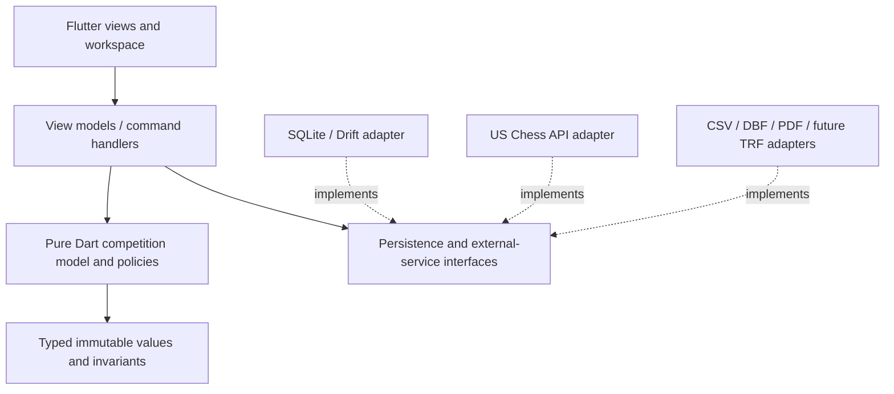

# Proposed architecture

Use a modular Flutter application with a pure Dart competition core and a local
relational store. One process and one authoritative event writer are sufficient
for the initial scope. The design aims at understandable changes and recoverable
mistakes, rather than importing distributed-system machinery into a club laptop.

## Responsibilities and dependency direction



The [Flutter architecture guide](https://docs.flutter.dev/app-architecture/guide)
separates views, view models, repositories and services, with a domain layer where
logic warrants it. Tournament pairing and reporting invariants warrant it here.
Keep widgets thin; command handlers coordinate I/O; policies accept explicit
immutable inputs. Use constructor injection at one composition root. Do not create
an interface for every class or a generic repository framework.

Target module responsibilities (see IMPLEMENTATION.md for current file layout):

```text
lib/
  app/                   composition, navigation, event lifecycle
  design_system/         theme, tables, forms, tabs, shortcuts
  domain/                entities, values, pairing, scoring, eligibility
  application/           import/review/pair/publish/correct/export commands
  infrastructure/        sqlite, us_chess, imports, reports, platform services
  features/              event, registration, sections, results, reporting
test/                    domain fixtures, command transactions, adapter contracts
integration_test/        complete TD workflows and platform behavior
```

Prefer feature files with narrow responsibilities over a giant tournament manager.
Start as one Dart package; split packages only when a real consumer needs the core.
No Python runtime is required by the proposed production application.

## Domain vocabulary

| Entity/value | What it owns |
|---|---|
| Person | Stable local identity, name variants, separately confirmed federation IDs |
| FederationIdentity | Federation + string ID; verification evidence and status |
| RatingObservation | Category/source/value/provisional state, dates and provenance |
| Event | Dates, location, TD/affiliate, templates copied into event policy |
| Entry | Person's participation, import provenance, check-in, eligibility and frozen ratings |
| Section | Membership, format, pairing/scoring/bye policy, schedule and lifecycle |
| Round | Pairing round index, schedule, publication revision, completion state |
| PairingProposal | Immutable inputs/revision, algorithm version, diagnostics and candidate games |
| Game | White/black entries, leg, actual outcome, played/unplayed state and rating eligibility |
| ByeAward | Recipient, round, reason and score; not a fake game against player zero |
| Team / Lineup | Team identity and per-round membership/board order where relevant |
| Match | Teams/participants and aggregate outcome; regular team boards vs bughouse are distinct |
| AuditRecord | Command, actor label, before/after/reason, revision and timestamp |
| ExportSnapshot | Exact event revision, export profile, artifacts and validation results |

Federation IDs are not primary keys. US Chess categories (R/Q/B/OR/OQ/OB) are not
one universal Elo field. Section type, game variant, pairing system, rating regime
and team structure must not collapse into a single overloaded enum.

Initially support standard-chess individual sections; keep explicit types for
future match structures without implementing a universal sports engine. A bughouse
match has four people and one competition result; its two boards are not two
independently ratable standard-chess games.

## Storage decision

SQLite is the proposed source of truth; Drift is the leading Dart access-layer
candidate, subject to platform/package review. Event relationships, reciprocal
results, constraints and multi-row updates favor transactions. JSON remains an
import/export/backup interchange option, not the authoritative file repeatedly
rewritten after every click.

Separate event documents from the optional reusable player/rating cache and from
OS-stored API credentials. Copying a tournament file must not copy API keys.
At first allow one writable owner per event; a second app instance opens read-only
or clearly refuses the write lock. Do not place a live database on a network share
and promise concurrent TD editing.

Use foreign keys, schema versions, migration fixtures, transactions and explicit
constraints. Store original source values alongside normalized ones when needed.
Round numbers, board numbers and export pairing numbers have explicit scopes.
Use date-only types for official event dates and zoned instants for actual schedule
times; avoid timezone shifts changing the reported event date.

## Mutations and corrections

Each meaningful action is a typed application command: ImportRoster,
ConfirmIdentity, ApplyRatingBatch, AssignSections, PublishPairings, RecordResult,
CorrectResult, WithdrawEntry, FinalizeSection or CreateReportSnapshot.

The handler loads the expected revision, validates invariants, writes all affected
rows plus the audit record in one transaction, increments revision and then
notifies views. UI acknowledgment follows commit. Double-clicks/retries need a
command ID or idempotent state transition. SQLite locking alone does not prevent
a late network response from overwriting a newer user edit; revision checks do.

Undo is domain-aware. Before publication, undo a draft or restore a saved draft
snapshot. After publication/results, issue a correction and record affected
dependencies. Never erase played games merely to “go back one round.” When an
earlier score changes, invalidate future proposals and explain consequences for
already-posted rounds. Do not automatically rerun the whole tournament.

Use relational state plus an audit log; **full event sourcing is not required**.
Every command stores a compressed snapshot as a node in a history tree, so any
earlier state can be reviewed and restored, and a restore never discards the
state it leaves (that becomes a branch). Rolling back recorded play is allowed
only after the TD confirms what it removes.

## Pairing and reports are computations over snapshots

Pairing takes a section snapshot and returns a proposal or typed failure, not
database mutations. It is deterministic given policy, input and random decisions.
Expensive search runs in an isolate, supports cancellation and returns diagnostics.
Review/publish checks the input revision again. Strategies: approved quad schedule,
US Chess Swiss, and later federation-specific engines. Share constraint primitives
only where the rules really agree.

Standings, tie-breaks and printed reports derive from the same immutable results
snapshot. A competition projection can exclude an early RR withdrawer's results
for prizes while the rating projection retains played games. Version projections
and invalidate caches after corrections; do not store several editable “truths.”

An external pairing executable, if chosen later, lives behind a narrow adapter
with pinned version/hash, process timeouts, structured input/output and capability
checks. Mobile/web cannot assume a desktop subprocess is available.

## Recovery and file publication

SQLite's [atomic-commit documentation](https://sqlite.org/atomiccommit.html)
explains the crash-consistency basis. Select and test journal/synchronous settings
for durable TD data; never trade acknowledged saves for an unmeasured speed gain.
Use [SQLite's backup API](https://sqlite.org/backup.html) or a proven consistent
snapshot mechanism. Copying only the main DB file while WAL is active is not a
safe portable backup strategy.

Keep automatic timestamped backups before migration, section repartition, rollback
and final reporting. Verify restoring one. Report disk-full, permissions, database
busy and corruption clearly. A “Save copy” feature produces an independently
openable consistent event, not a hidden pointer to the original directory.

Exports write into a fresh temporary sibling directory, validate there, then
publish a complete new package. Retain an immutable manifest. If a platform cannot
guarantee atomic directory publication, use a completion marker/manifest and never
show incomplete packages as ready. The export commit and UI status must agree.

## Cross-platform and dependency discipline

Choose desktop file pickers, secure storage, print/PDF libraries and SQLite bindings
only after checking their current licenses and platform matrices. Desktop Flutter
support is documented at [Supported platforms](https://docs.flutter.dev/reference/supported-platforms),
but individual plugins still need real Windows/macOS/Linux qualification.

Prefer SDK `ChangeNotifier`/`ValueListenable` plus immutable view states initially,
matching familiar V2 concepts; reassess a state library only if dependency/lifecycle
complexity justifies it. Dispose controllers/subscriptions, reject stale async
results, and use typed failures translated at the UI boundary. Use Effective Dart
style and exhaustive sealed-result handling rather than magic strings/maps.

Dependency choices, exact versions, license review, signing/notarization and release
packaging remain implementation milestones. IMPLEMENTATION.md records adopted dependencies, checks and remaining platform gates.

## TD operations and effective section transitions

[TD_OPERATIONS.md](TD_OPERATIONS.md) is a core domain contract. Section moves and
combination must not be implemented as overwriting one `sectionId` on historical
entries. Preserve effective-round membership transitions, entry lineage and source
section attribution; separate playing pool from prize eligibility and federation
reporting groups. Review round/score/color/opponent/bye mapping before a post-play
transition. A spelling/ID correction is distinct from replacing a game participant.
All UI entry points share commands for EditEntry, SetParticipation, TransferEntries,
CombineSections and CorrectResult (names illustrative). Commit mutation, audit and
invalidations atomically; published revisions and played games remain traceable.

## Unfinished games and TD decisions

Do not require a final outcome merely to construct every next-round proposal.
Represent a policy-authorized, TD-approved pairing assumption separately, with
its reason, scope and input revision. It changes the relevant pairing projection
only; it cannot create a rated game result or final prize outcome. Resolving the
actual game recalculates affected projections and reviews dependent publications.
Link private ruling/appeal records to stable game/entry IDs; keep clock actions
and other non-score decisions separate from outcome commands. See
[TD duties](../research/notes/TD_DUTIES.md) and [result entry](RESULT_ENTRY.md).
